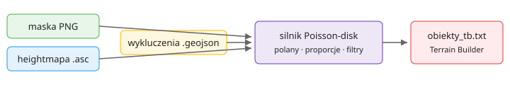

# DayZ Forest Generator

Desktopowy generator lasów dla **DayZ** (Rust + egui). Z maski satelitarnej
PNG, opcjonalnej heightmapy ASC i wykluczeń GeoJSON generuje plik TXT
z setkami tysięcy drzew gotowy do importu w **Terrain Builder** (DayZ Tools).

**Język interfejsu:** 🌐 Polski / English / Deutsch — przełącznik na pasku
narzędzi; wybór zapisywany w `ui_settings.json`.



```
maska PNG ─┐
heightmapa .asc ─┼─► silnik Poisson-disk ─► obiekty_tb.txt ─► Terrain Builder
wykluczenia .geojson ─┘   (polany, proporcje,
                           filtry wysokości/spadku)
```

## Budowanie

Wymagany Rust (stable, tested 1.97+):

```powershell
cargo build --release
# binarki:
#   target\release\forest-gui.exe   — aplikacja desktopowa
#   target\release\forest-cli.exe   — tryb wsadowy
```

## Szybki start (przykładowe dane)

```powershell
cargo run -p forest-core --example make_samples   # tworzy assets/samples/*
.\target\release\forest-cli.exe run assets\samples\sample_project.json -o output\obiekty_tb.txt
.\target\release\forest-gui.exe                    # albo GUI: "Wczytaj projekt" -> sample_project.json
```

Przykład: mapa 15 360 m, 2 strefy lasu, droga i jezioro wykluczone,
~1,3 mln obiektów w ~40 s.

## GUI — przepływ pracy

Układ okna: **lewy panel = ustawienia** (pliki, źródła, mapa, filtry, rozrzut,
granica, gatunki), **prawy panel = presety i wygenerowane warstwy** (strefy,
moje presety, obszary, wynik generowania ze statystyką per źródło).

1. **Pliki** → wczytaj maskę PNG/BMP/TGA (kolory = strefy lasu).
   Opcjonalnie dołącz **podkład satelitarny** (PNG/JPG) — rysowany pod maską
   z regulowanym kryciem, przydatny jako odniesienie przy strojeniu stref.
2. Opcjonalnie: heightmapa `.asc` (filtry wysokości/spadku, elevation absolute)
   oraz wykluczenia `.geojson` (czerwone obrysy na podglądzie).
3. **Strefy lasu** → dodaj strefę jednym kliknięciem z **presetu roślinności**
   (grupy: Iglaste / Liściaste / Mieszane / Krzewy i zarośla — każdy preset
   ustawia gęstość i proporcje gatunków) albo klikając wolny kolor z maski;
   wszystko można potem dostroić ręcznie.
   **📚 Moje presety** — edytowalne szablony: ⧉ kopiuj wbudowane, twórz własne,
   zmieniaj nazwy/grupy/gęstości/wagi gatunków (po nazwie modelu — przenośne).
   Zapisywane do `presets_user.json` (przycisk 💾; ★ w listach = moje presety).
3a. **Obszary (poligony)** — alternatywa dla maski: kliknij „✏ Rysuj obszar” i
   klikaj wierzchołki LPM na mapie (Enter/dwuklik = zakończ, Esc = anuluj,
   Backspace = cofnij punkt). Obrys **nie może przecinać samego siebie** —
   generator odmówi z opisem. Można generować wyłącznie z poligonów, bez maski.
   Można też **📥 importować poligony z Shapefile (`.shp`)** — każdy poligon
   staje się osobnym obszarem (dziury/wycięcia są zachowane; atrybuty `.dbf`
   nie są importowane). Współrzędne w układzie TB (easting ≥ 100 000) są
   automatycznie normalizowane.
   **Edycja obszaru:** w 📐 Obszary kliknij **✏**, potem na mapie: przeciągnij
   biały uchwyt = przesuń wierzchołek, kliknij zielony punkt (środek krawędzi)
   = dodaj wierzchołek, Backspace = usuń wybrany, Esc/Enter/dwuklik = koniec.
3b. **⚙ Źródła generowania** — przełączniki: strefy z maski / obszary rysowane /
   granica lasu. Wyłączone źródła są pomijane niezależnie od reszty konfiguracji.
3c. **Granica lasu** — opcjonalny pas krzewów/podrostu wzdłuż krawędzi lasu
   (szerokość pasa, gęstość, gatunki). Działa zarówno dla stref z maski
   (pas do wewnątrz), jak i dla poligonów (po obu stronach obrysu).
   **Wtapianie** — gęstość zanika z odległością od granicy (5 warstw,
   najgęściej przy samej krawędzi). **Poszarpanie [m]** — szum przesuwający
   efektywną linię lasu, dzięki czemu brzeg nie jest równy jak od linijki
   (dotyczy też obrysów rysowanych poligonów). **Wtapianie w las [m]** —
   jak głęboko od krawędzi gęstość drzew narasta 0 → pełna.
3d. **Własna granica per-obszar** — w panelu 📐 Obszary zaznacz „Własna
   granica", aby nadpisać globalne parametry dla tego jednego obszaru.
3e. **✂ Wycinanie (kolor + bufor)** — usuwa WYGENEROWANE obiekty w buforze
   [m] wokół pikseli wybranego koloru maski (np. szare drogi + 10 m).
   Działa na wszystkie źródła, także rysowane poligony; nakładane przy każdym
   generowaniu. Ustawienia z pomarańczową etykietą mają ⟲ do wartości
   domyślnej obok pola.
4. **Filtry / Rozrzut** → min./maks. wysokość, maks. spadek, tolerancja koloru,
   mnożnik odstępów, skala i siła polan.
5. **▶ Generuj** → podgląd punktów na masce (kolor = gatunek), statystyki.
6. **💾 Eksport TXT (TB)** → zapis pliku dla Terrain Buildera.
   **🖼 Eksport PNG (drzewa)** → przezroczysta warstwa drzew (kropki w kolorach
   gatunków) w rozdzielczości równej rozmiarowi mapy (1 px = 1 m).
7. **💾 Zapisz projekt** → cały setup w jednym `.json` (ścieżki + parametry).
8. **🌳 Gatunki → 🎨** → ustaw indywidualny kolor gatunku: własny (paleta
   kolorów) albo wybrany z wczytanej maski („Kolor z maski"). Kolor ten widnieje
   w podglądzie, nakładce drzew i eksporcie PNG; „⟲ auto" przywraca automat.

Kanvas: scroll = zoom do kursora, LPM/PPM drag = pan, **dwuklik** lub
„Dopasuj widok” = reset. Widok jest przyciągany — mapa nie może wylecieć
poza ekran (przy oddaleniu mniejszym od kanwy jest automatycznie wycentrowana).

## Format eksportu (Terrain Builder)

Każdy wiersz:

```
"t_PiceaAbies_2f";211294.535483;8315.806183;21.757461;1.072276;0.410091;1.100093;0.000000;
```

`"model";X;Y;Yaw;Pitch;Roll;Scale;Elevation;` — X zawiera **easting offset
(domyślnie +200 000)**, Y ewentualny northing offset.

### Konwencja współrzędnych (jak w mapach DayZ/Arma)

Lewy dolny róg (SW) mapy to **X = 200000, Y = 0** (fałszywy UTM easting;
ChernarusPlus: 15360×15360 m). W heightmapie ASC odpowiada temu nagłówek
`xllcorner 200000` / `yllcorner 0`. Program ma te wartości jako domyślne
(pola *Easting/Northing offset*), a parser ASC sam rozpoznaje układ TB
(`xllcorner ≥ 100000` → traktuje współrzędne świata z offsetem). Nazwa modelu musi
istnieć w **Template Library** projektu TB (domyślna biblioteka programu
używa nazw vanilla z `dz\plants\tree\` i `dz\plants\bush\`, np.
`t_BetulaPendula_2f` — dostosuj do własnej biblioteki w zakładce „Gatunki”).

Import w TB: `Objects → Import → Objects…`, wybierz plik, odznacz *Threshold
options*, format rekordu **Terrain Builder**, a przy pytaniu o wysokość wybierz
**relative to terrain** (gdy `ElevationMode = relative`) lub **absolute**
(gdy `absolute (z ASC)`).

**Ważne:** Terrain Builder odrzuca cały import (`Wrong file format or source
template not found`), jeśli choć jednego modelu z pliku nie ma w Template
Library. Wbudowana biblioteka (44 gatunki w grupach: Liściaste / Iglaste /
Krzewy / Bliss / Sakhal) zawiera wyłącznie nazwy zweryfikowane z
P:\DZ\plants, P:\DZ\plants_bliss i P:\DZ\plants_sakhal — przed importem użyj
**🔍 Sprawdź modele na P:\\** (GUI, zakładka 🌳 Gatunki) albo
`forest-cli check-models projekt.json`.

## CLI

```
forest-cli init projekt.json            przykładowy projekt do edycji
forest-cli validate projekt.json        walidacja konfiguracji
forest-cli run projekt.json [-o out.txt] [--seed N] [--quiet]
```

## Jak działa silnik

- **Klasyfikacja maski**: każdy piksel trafia do strefy po najbliższym kolorze
  z palety (tolerancja = suma różnic kanałów); kolory wykluczone mają priorytet.
- **Cel gęstości**: `liczba_pikseli × pole_piksela [ha] × szt/ha`.
- **Poisson-disk (dart throwing)**: losowe próbkowanie pikseli strefy z jitterem,
  siatka przestrzenna pilnuje minimalnego odstępu
  `d = spacing × √(0.7 · A / cel)`. Gdy filtry/polany utrudniają osiągnięcie
  celu, kolejne przebiegi zmniejszają `d` (max 5 przebiegów × 0.85).
- **Polany**: 3-oktawowy value noise; próg dobrany tak, aby odrzucona część
  obszaru ≈ „siła polan”. Polany kształtują rozkład, nie zmniejszają liczby
  drzew (cel gęstości jest wyrównywany zagęszczeniem reszty obszaru).
- **Heightmapa ASC**: próbkowanie dwuliniowe (wartości = środki komórek),
  spadek metodą centralnej różnicy. Jeśli `xllcorner ≥ 100000`, ASC jest
  traktowany jako w układzie z offsetem easting (konwencja TB) — automat.
- **Determinizm**: to samo ziarno + te same wejścia = identyczny wynik.

## Struktura repo

```
crates/forest-core    biblioteka: parsery, silnik, eksport (30 testów jednostkowych)
crates/forest-gui     aplikacja eframe/egui
crates/forest-cli     narzędzie wsadowe
assets/samples/       przykładowa maska, ASC, GeoJSON, projekt
```

## Testy

```powershell
cargo test -p forest-core
```

## Uwagi

- Limit bezpieczeństwa: 2 000 000 obiektów na jedno generowanie.
- Pliki wyjściowe >100 MB są normalne dla gęstych lasów mapowych.
- Współrzędne GeoJSON i Shapefile (`.shp`): metry mapy, origin SW; offset
  easting jest usuwany automatycznie, gdy maks. X > 100 000.
