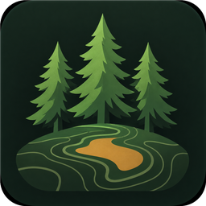
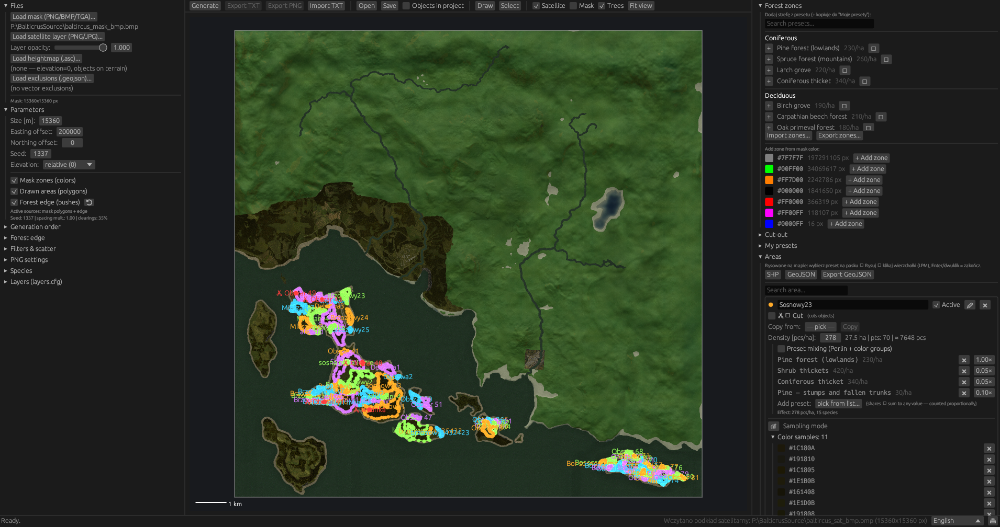
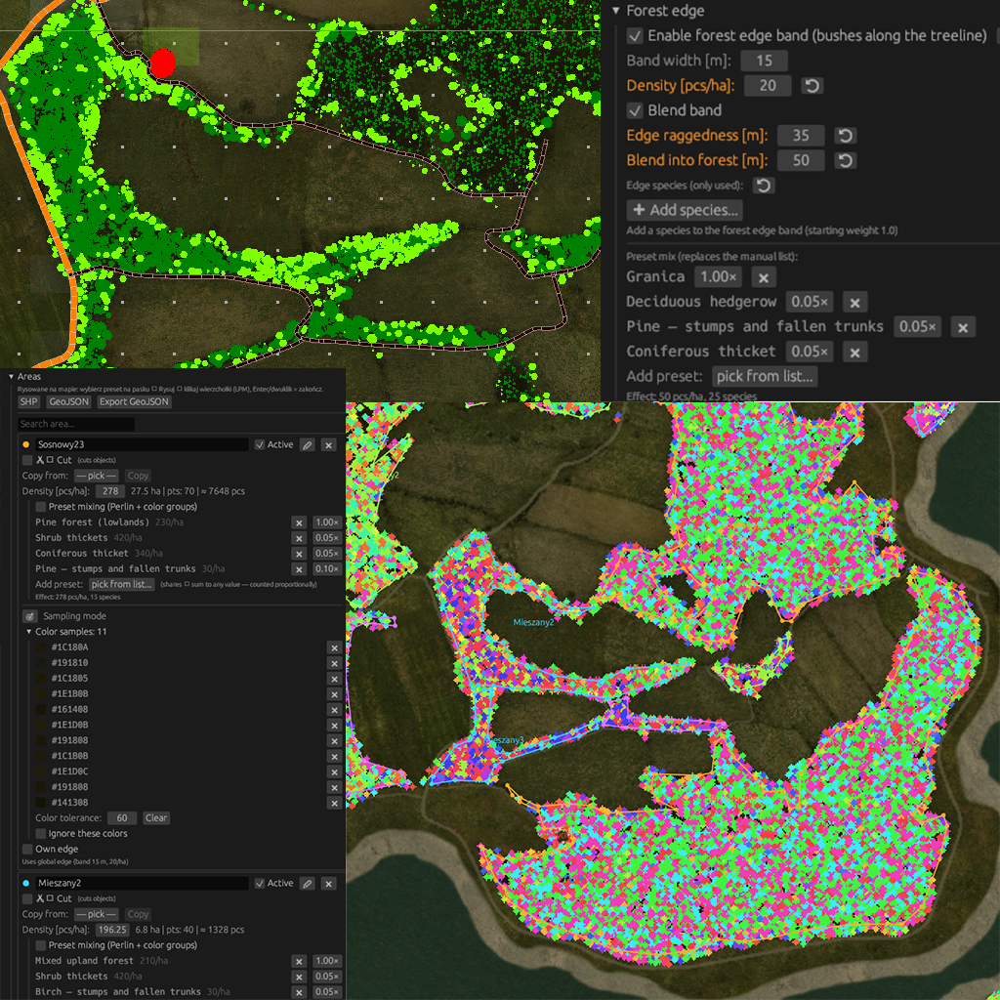
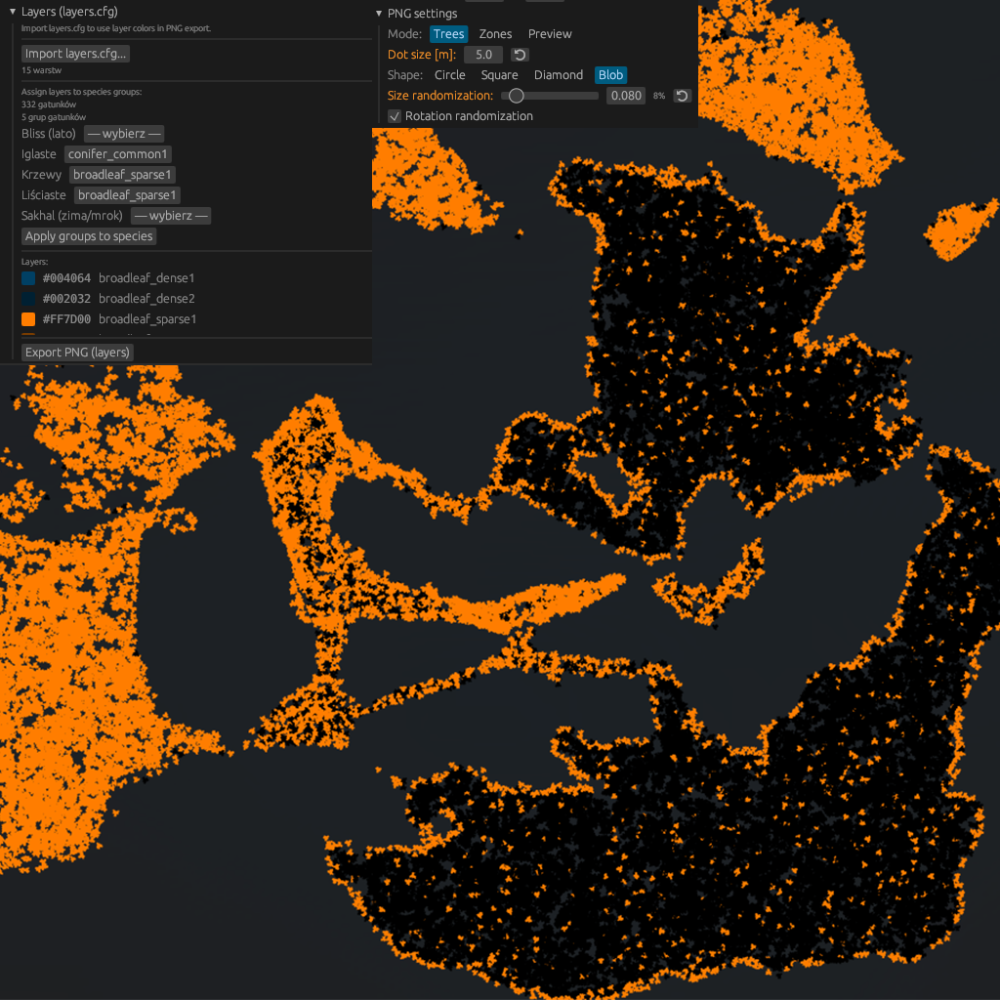
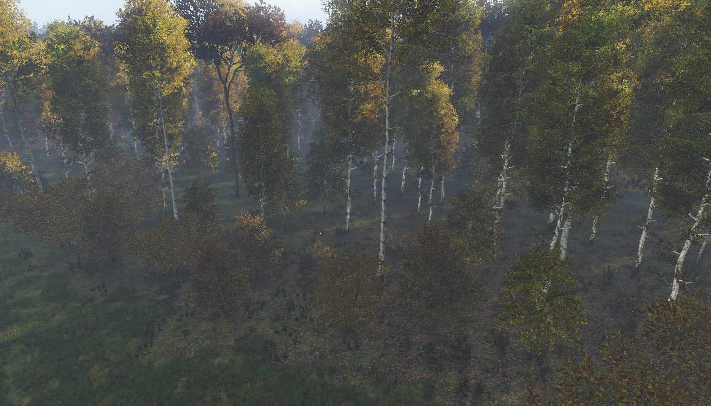
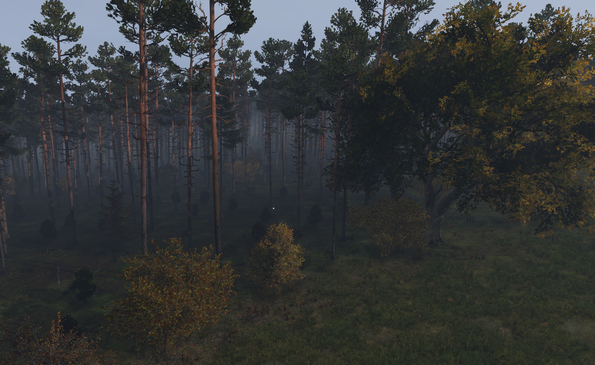
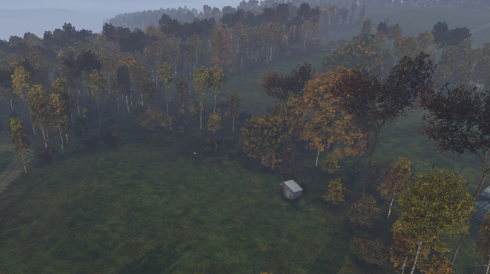

# DayZ Forest Generator

<p align="center">
  
</p>

A desktop forest generator for **DayZ**, built with Rust and egui. It places
trees, shrubs, and other plant models from color-coded map masks, drawn or
imported polygons, or both. The result can be exported as a Terrain Builder
object TXT file or a transparent PNG layer. A command line tool supports
project validation and batch TXT generation.

The interface supports **Polski, English, and Deutsch**. Select a language in
the toolbar; the choice and keyboard shortcuts are stored in `ui_settings.json`.

The pipeline accepts a mask and/or polygon areas, with optional heightmap,
GeoJSON exclusions, and satellite color filters. It generates placements for
Terrain Builder TXT export and GUI PNG rendering.

## Build and try it

Install a stable Rust toolchain, then build the workspace from the repository
root.

On Windows, the GUI build embeds this icon in the executable and uses it for
the window. Windows builds need the Windows SDK resource compiler and MSVC C++
build tools (`rc.exe` and `cvtres.exe`).

```powershell
cargo build --release
```

On Windows, this produces `target\release\forest-gui.exe` and
`target\release\forest-cli.exe`. The repository already includes a sample
project, mask, heightmap, and exclusion file:

```powershell
.\target\release\forest-gui.exe
# In the GUI, choose Open and select assets\samples\sample_project.json.

.\target\release\forest-cli.exe validate assets\samples\sample_project.json
.\target\release\forest-cli.exe run assets\samples\sample_project.json -o obiekty_tb.txt
```

Run these commands from the repository root because the sample project's
input paths are relative to it. To regenerate the sample assets, run
`cargo run -p forest-core --example make_samples`.

## GUI workflow

1. **Set up the map.** Under **Files**, load a PNG, BMP, or TGA mask whose
   colors represent forest zones. A mask is optional if you use polygons
   instead. Set the square map size and Terrain Builder easting/northing
   offsets under **Parameters**. The defaults are 15,360 m, 200,000, and 0.
2. **Add optional inputs.** Load an ASC heightmap for altitude/slope filters
   and absolute elevation, a GeoJSON file of exclusion polygons, and a
   satellite image (PNG/JPG) as a visual reference. The satellite image can
   also supply sampled colors for area or preset filters.
3. **Configure generation sources.** Add mask colors as **Forest zones** and
   assign species and density manually or from built-in vegetation presets.
   Use **Draw** to create polygon **Areas**, or import polygons from
   Shapefile (`.shp`) or GeoJSON. Polygon holes are preserved; Shapefile
   `.dbf` attributes are ignored. Assign a preset, species, and density to
   each area that should generate objects. You can enable mask zones and
   areas independently under **Parameters**.
4. **Shape the forest.** Set species weights, density, scale, clearings,
   altitude and slope limits, mask color tolerance, and spacing. An area can
   mix presets across Perlin noise patches, use sampled satellite colors to
   include or exclude locations, and override the global forest edge band.
   The optional edge band adds undergrowth around boundaries, with blending
   and a jagged edge. Customize or import/export user presets in **My
   presets**; they are saved to `presets_user.json` in the working directory.
5. **Set the generation order.** In **Generation order**, move the mask,
   individual areas, and mask color cuts to control which objects are placed
   first. Areas can also act as cutting polygons. A cut removes objects
   created before that step, so later steps can refill the cleared space.
   Mask color cuts support a distance buffer and also affect polygon objects
   when placed after them.
6. **Generate and export.** Choose **Generate** to preview placements and
   per source statistics. **Export TXT** writes Terrain Builder objects.
   **Export PNG** writes a transparent layer using the mode selected under
   **PNG settings**: Trees, Zones (requires a mask), or Preview. Tree mode
   supports dot size, shape, and size/rotation variation. The PNG resolution
   is normally one pixel per map meter, clamped to 64–16,384 pixels per side.
   Import a Terrain Builder TXT with **Import TXT** to inspect or re-export
   its objects; importing replaces the current generated objects after
   confirmation.

The **Species** panel lets you adjust model names and preview colors, and
import/export species as JSON. **Forest zones** can also be imported/exported
as JSON, while **Areas** can be exported as GeoJSON. Import `layers.cfg` in
the **Layers** panel, assign layers to species or species groups, and use
**Export PNG (layers)** for a tree image colored with those layers.

On the map, scroll to zoom around the cursor, drag to pan, and use **Fit
view** or double click to reset the view. Draw polygons with left clicks;
Enter or double click finishes, Esc cancels, and Backspace removes the last
point. Self-intersecting polygons are rejected with a location in the error
message. The toolbar also supports area selection; polygon vertices can be
edited with handles.

## Screenshots

The editor screenshots show the map preview, polygon areas, forest edge
controls, and PNG layer export. The in-game images show forests placed with
the generator.

<table>
  <tr>
    <td align="center"></td>
    <td align="center"></td>
    <td align="center"></td>
  </tr>
  <tr>
    <td align="center">Map editor with generated tree placements and forest zones.</td>
    <td align="center">Polygon areas and configurable undergrowth along forest edges.</td>
    <td align="center">PNG layer preview and imported Terrain Builder layer colors.</td>
  </tr>
</table>

### In-game results

<table>
  <tr>
    <td align="center"></td>
    <td align="center"></td>
    <td align="center"></td>
  </tr>
  <tr>
    <td align="center">An autumn mixed forest with birch and conifer models.</td>
    <td align="center">A denser conifer stand with varied understory.</td>
    <td align="center">A more open forest layout across rolling terrain.</td>
  </tr>
</table>

## Projects and saved objects

**Save** writes the project settings, input paths, zones, areas, species,
generation order, layers, and PNG settings to a JSON file. Once the project
has a path, the GUI also autosaves it about every 60 seconds.

Generated placements are optional separate data. Enable **Objects in
project** in the toolbar to save them beside `forest.json` as
`forest.objects.json`; opening the project restores those objects and their
statistics. With the option off, saving the project removes an existing
objects sidecar. The preference is stored in `ui_settings.json`.

## Command line interface

```text
forest-cli init <project.json>
forest-cli validate <project.json>
forest-cli check-models <project.json>
forest-cli run <project.json> [-o <output.txt>] [--seed <number>] [--quiet]
```

`init` creates an editable starter project; configure its input paths before
running it. `validate` checks project settings. `check-models` scans
`P:\DZ\plants*` for model names referenced by the project and requires a
mounted DayZ work drive. `run` generates and writes a Terrain Builder TXT;
its default output name is `obiekty_tb.txt`. The CLI uses the same project
settings and generation engine as the GUI.

## Terrain Builder export

Each TXT line has this form:

```text
"t_PiceaAbies_2f";211294.535483;8315.806183;21.757461;1.072276;0.410091;1.100093;0.000000;0;
```

```text
"model";X;Y;Yaw;Pitch;Roll;Scale;Elevation;Underground;
```

The exporter adds the project's easting offset to X and northing offset to
Y. The southwest map corner is therefore X = 200,000 and Y = 0 with the
defaults. `Underground` is always `0`. Relative elevation exports zero;
absolute elevation samples the ASC heightmap. Select the corresponding
relative or absolute placement option when importing into Terrain Builder.

Every exported model must exist in the Terrain Builder project's **Template
Library**. If Terrain Builder reports `Wrong file format or source template
not found`, check the library against the model names in the TXT. The GUI's
**Check models on P:\\** action and `forest-cli check-models` can compare
project models with files on the DayZ work drive, including `plants`,
`plants_bliss`, and `plants_sakhal`.

ASC and polygon coordinates are in map meters with the southwest corner as
the origin. For an ASC heightmap using Terrain Builder coordinates,
`xllcorner 200000` and `yllcorner 0` match the default offsets. The ASC
parser detects a large easting, and GeoJSON/Shapefile polygon import removes
the configured easting offset when its coordinates use that convention.

## How placement works

- Mask pixels are matched to the nearest configured zone color within the
  color tolerance; excluded colors have priority.
- Density targets are based on source area in hectares and objects per
  hectare. A seeded Poisson-disk sampler uses a shared spacing grid across
  enabled sources. It makes up to five passes with a smaller spacing when
  placement is constrained.
- Clearings come from layered value noise. Heightmap samples and slope
  calculations filter candidates; GeoJSON exclusions and satellite color
  filters can reject them as well.
- The same project inputs and seed produce the same generated placements.
  Generation has a safety limit of **2,000,000 objects**.

## Repository layout and tests

| Path | Purpose |
| --- | --- |
| `crates/forest-core` | Parsers, project model, placement engine, and exporters |
| `crates/forest-gui` | eframe/egui desktop application |
| `crates/forest-cli` | Batch generation and validation |
| `assets/samples` | Example project and map inputs |

```powershell
cargo test -p forest-core
```
